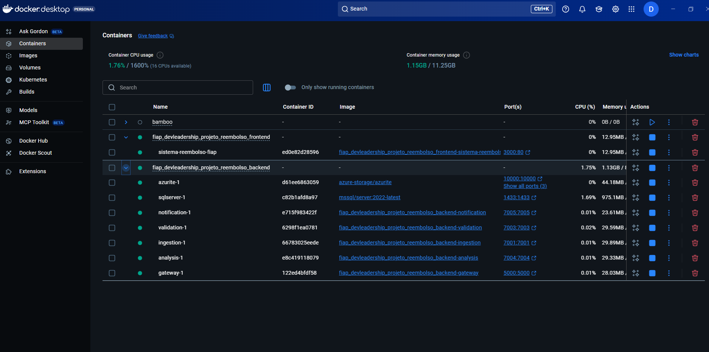

# 🚀 Sistema de Avaliação Automática de Reembolso - Coris Seguros

## 🎓 Projeto FIAP DevLeadership

Este projeto foi desenvolvido como parte do curso **FIAP DevLeadership** e tem como objetivo demonstrar uma arquitetura de microsserviços completa para automação de reembolso de passagens aéreas.

### 🎯 Objetivos do Projeto

- 🏗️ **Demonstrar arquitetura de microsserviços** com separação clara de responsabilidades
- 🔧 **Implementar padrões de desenvolvimento** como DDD, CQRS e Event Sourcing
- ☁️ **Utilizar tecnologias cloud** do Azure para escalabilidade e confiabilidade
- 🚀 **Aplicar boas práticas** de DevOps, CI/CD e monitoramento
- 🔗 **Mostrar integração** entre diferentes serviços e APIs externas

### 📸 Demonstração de Containers



*Screenshot mostrando todos os serviços rodando com sucesso no Docker Compose*

## 🏗️ Arquitetura de Microsserviços

Este projeto implementa uma solução completa de automação de reembolso utilizando arquitetura de microsserviços no Azure, demonstrando os conceitos aprendidos no curso FIAP DevLeadership.

### 🔧 Componentes da Arquitetura

- 🌐 **Gateway de API** - Ponto de entrada unificado (.NET/YARP)
- 📥 **Serviço de Ingestão** - Recebe e armazena documentos (.NET/C#)
- 👁️ **Serviço de OCR/Extração** - Processa documentos com Azure AI Vision (Azure Functions)
- ✅ **Serviço de Validação** - Integração com APIs externas (.NET/C#)
- 🧠 **Serviço de Análise** - Aplica regras de negócio (.NET/C#)
- 📧 **Serviço de Notificação** - Envia notificações (.NET/C#)

### 🛠️ Tecnologias Utilizadas

- 💻 **Backend**: .NET 8, C#, Azure Functions
- 🗄️ **Banco de Dados**: Azure SQL Database
- 📦 **Armazenamento**: Azure Blob Storage
- 📨 **Mensageria**: Azure Service Bus
- 👁️ **OCR**: Azure AI Vision
- 🌐 **Gateway**: YARP (Yet Another Reverse Proxy)

### 📁 Estrutura do Projeto

```
├── src/
│   ├── Gateway/                 # 🌐 Gateway de API
│   └── Services/
│       ├── Ingestion/          # 📥 Serviço de Ingestão
│       ├── OCR/               # 👁️ Serviço de OCR/Extração
│       ├── Validation/        # ✅ Serviço de Validação
│       ├── Analysis/          # 🧠 Serviço de Análise
│       └── Notification/      # 📧 Serviço de Notificação
├── infrastructure/             # 🏗️ Scripts de infraestrutura
└── docs/                      # 📚 Documentação
```

### 🚀 Como Executar

#### 🐳 Opção 1: Docker Compose (Recomendado)

1. **📋 Pré-requisitos**:
   - 🐳 Docker Desktop
   - 🔧 Docker Compose

2. **▶️ Executar todos os serviços**:
   ```bash
   # Build e execução dos containers
   docker-compose up --build
   
   # Executar em background
   docker-compose up -d
   ```

3. **📊 Verificar status dos serviços**:
   ```bash
   docker-compose ps
   ```

4. **🌐 Acessar os serviços**:
   - 🌐 **Gateway**: http://localhost:5000
   - 📥 **Ingestion**: http://localhost:7001/swagger
   - ✅ **Validation**: http://localhost:7003/swagger
   - 🧠 **Analysis**: http://localhost:7004/swagger
   - 📧 **Notification**: http://localhost:7005/swagger
   - 🗄️ **SQL Server**: localhost:1433
   - 📦 **Azurite (Storage)**: localhost:10000-10002

#### 💻 Opção 2: Execução Individual

1. **📋 Pré-requisitos**:
   - 💻 .NET 8 SDK
   - 🗄️ SQL Server (local ou Docker)
   - 📦 Azure Storage Emulator (Azurite)

2. **⚙️ Configuração**:
   ```bash
   # Restaurar pacotes .NET
   dotnet restore
   ```

3. **▶️ Executar cada serviço**:
   ```bash
   # Gateway
   cd src/Gateway
   dotnet run
   
   # Ingestion
   cd src/Services/Ingestion
   dotnet run
   
   # Validation
   cd src/Services/Validation
   dotnet run
   
   # Analysis
   cd src/Services/Analysis
   dotnet run
   
   # Notification
   cd src/Services/Notification
   dotnet run
   ```

### ✅ Testes Realizados

- 🏗️ **Build dos Containers**: Todos os serviços compilados com sucesso
- ▶️ **Execução dos Containers**: Todos os containers em execução
- 🌐 **Conectividade**: Serviços respondendo nas portas configuradas
- 📚 **Swagger UI**: Documentação da API disponível em todos os serviços
- 🗄️ **Banco de Dados**: SQL Server funcionando corretamente
- 📦 **Storage**: Azurite (Azure Storage Emulator) operacional

### ☁️ Arquitetura Cloud

- 🚀 **Azure App Service** - Hospedagem dos microsserviços
- ⚡ **Azure Functions** - Processamento serverless
- 📦 **Azure Blob Storage** - Armazenamento de documentos
- 📨 **Azure Service Bus** - Fila de mensagens
- 👁️ **Azure AI Vision** - OCR e processamento de imagens
- 🗄️ **Azure SQL Database** - Banco de dados relacional
- 🌐 **Azure API Management** - Gateway de API
- 🔐 **Azure Key Vault** - Gestão de segredos

### 🏗️ Conceitos de Arquitetura Aplicados

#### 🎨 Padrões de Design
- 🏛️ **Domain-Driven Design (DDD)**: Separação clara de domínios e contextos
- 🔄 **CQRS**: Separação entre comandos e consultas
- 📝 **Event Sourcing**: Rastreamento de eventos de negócio
- 🗃️ **Repository Pattern**: Abstração de acesso a dados
- 💉 **Dependency Injection**: Inversão de controle

#### 🔗 Padrões de Integração
- 🌐 **API Gateway**: Ponto de entrada unificado
- 📨 **Service Bus**: Comunicação assíncrona entre serviços
- ⚡ **Event-Driven Architecture**: Comunicação baseada em eventos
- 🔌 **Circuit Breaker**: Tolerância a falhas
- 🔄 **Retry Pattern**: Recuperação automática de falhas

#### 🧩 Princípios SOLID
- 🎯 **Single Responsibility**: Cada serviço tem uma responsabilidade específica
- 🔓 **Open/Closed**: Extensível sem modificação
- 🔄 **Liskov Substitution**: Substituição de implementações
- 🎭 **Interface Segregation**: Interfaces específicas
- ⬆️ **Dependency Inversion**: Dependência de abstrações

### 🔐 Segurança

- 🔒 Criptografia de dados em repouso e em trânsito
- 👤 Azure Active Directory para autenticação
- 🗝️ Azure Key Vault para gestão de segredos
- 📊 Monitoramento com Azure Monitor e Application Insights

### 📊 Monitoramento e Observabilidade

- 📝 **Logs estruturados** com Serilog
- 📈 **Métricas de performance** com Application Insights
- ❤️ **Health checks** para todos os serviços
- 🔍 **Distributed tracing** para rastreamento de requisições
- 🚨 **Alertas automáticos** para falhas e degradação

### 🚀 DevOps e CI/CD

- 🐳 **Containerização** com Docker
- 🎼 **Orquestração** com Docker Compose
- 🏗️ **Infraestrutura como código** com Azure Resource Manager
- 🚀 **Deploy automatizado** com Azure DevOps
- 🧪 **Testes automatizados** em pipeline de CI/CD

### 🤝 Contribuição

Este projeto foi desenvolvido como parte do curso **FIAP DevLeadership** para demonstrar:

1. 🏗️ **Arquitetura de Microsserviços** em ambiente real
2. ☁️ **Integração com serviços Azure** nativos
3. 🔧 **Padrões de desenvolvimento** modernos
4. 🚀 **Boas práticas** de DevOps e monitoramento
5. 📈 **Escalabilidade** e **confiabilidade** em produção

### 👥 Autores

-  **Autor**: Jucelio Alencar 
- 🎓 **Curso**: FIAP DevLeadership
- 🎯 **Objetivo**: Demonstrar arquitetura de microsserviços
- 🛠️ **Tecnologias**: .NET 8, Azure, Docker, SQL Server
